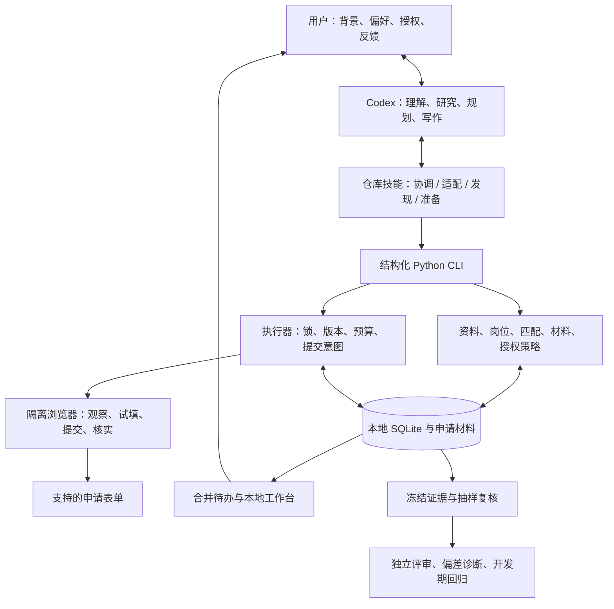

# Codex Job Agent

面向 Codex 设计的个人求职 Agent。通过仓库技能组织岗位研究、个性化匹配和申请准备，
通过本地 Python 工具管理状态、检查授权、执行支持的申请表单并保留验证证据。

这是一个个人工程项目，当前版本为 **0.1.0**。用户在 Codex 中打开仓库后，通过自然
语言安排求职任务；Codex 使用当前会话进行理解、规划和写作，无需为本项目另配模型
API key。交付形式为**仓库技能集与本地工具包**。

## 工作方式

目标是扩大符合用户意愿的岗位覆盖，并把更多准备时间留给高匹配机会。每天可配置
处理 50–100 个候选岗位，包含筛选、研究与准备，不等于承诺提交相同数量的申请。

1. **个性化适配**：整理并确认经历事实、求职方向、硬性限制，以及自动投递与人工
   审核的边界；后续会话读取已保存资料和反馈。
2. **岗位研究与匹配**：读取 Greenhouse、Lever、Ashby 公开岗位板，也可由 Codex
   研究后导入岗位。保留来源与版本，合并重复投递目标，未知条件进入待办。
3. **材料与执行**：准备有事实依据的申请包。Codex 安排工作次序，本地执行器检查
   当前材料、授权、预算和表单，再执行获准的提交。
4. **反馈与迭代**：集中展示需要用户决定的问题；对已确认投递的冻结材料抽样复核，
   开发阶段通过问题证据、根因假设和独立回归改进系统。

## 架构



Codex 根据当前任务选择和组合操作。Python 的领域模型、纯匹配与策略、持久化、
材料渲染、浏览器 I/O、执行器和评测分开实现。申请状态记录已发生的工作及继续执行
的条件；技能指导 Codex 选择下一步。

提交审批绑定完整申请包，包括答案、附件内容哈希、岗位与用户资料版本和浏览器
计划。执行器在点击前记录提交意图；回执不明确时保留 `unknown`，经核实后才能重试。
默认配置要求审核，用户可以自行设定自动提交范围。

## 快速开始

需要已安装的 [uv](https://docs.astral.sh/uv/) 和可打开本地项目的 Codex 环境。
Python 版本由 `.python-version` 指定，依赖版本由 `uv.lock` 固定。

```sh
git clone https://github.com/WItaZhang/codex-job-agent.git
cd codex-job-agent
uv sync --locked --extra dev
uv run playwright install chromium
uv run applypilot-agent --help
```

把这个目录作为 **Codex 项目打开**，首次使用可以直接说：

> 用 $applypilot-onboard 配置我的求职助手。我会提供简历，请先整理经历、求职方向
> 和限制，再与我确认哪些岗位可以自动投递、哪些需要先审核材料。

日常使用：

> 用 $applypilot 继续今天的求职，最多处理 80 个岗位。优先准备高匹配机会，按保存的
> 授权执行其他申请，需要我回答的问题集中给我。

| 技能 | 职责 |
| --- | --- |
| `$applypilot` | 协调会话、队列、待办、申请与质量复核 |
| `$applypilot-onboard` | 确认事实、求职偏好、限制和投递授权 |
| `$applypilot-discover` | 发现岗位、研究要求并记录有依据的匹配判断 |
| `$applypilot-prepare` | 准备申请包、观察表单、试填并执行获准的提交 |

技能位于 `.agents/skills/`。为保持命令和已有操作记录兼容，0.1.0 保留
`applypilot-agent` CLI、`applypilot_agent` Python 模块和 `applypilot*` 技能标识。
项目与发行包名称为 `codex-job-agent`。

若当前 Codex 会话尚未发现技能，可在该项目开启新会话，或明确让 Codex 读取对应的
`SKILL.md`。详细操作见 [使用指南](docs/agent/USAGE.md)。

## 配置与本地数据

`configs/agent.yaml` 配置工作规模、每日提交尝试限额、审核策略、浏览器参数和抽检
频次。路径相对于配置文件解析。默认个人状态保存在被 Git 忽略的 `data/local/`，
实验与演示产物写入 `logs/`。

```sh
uv run applypilot-agent --config configs/agent.yaml status
uv run applypilot-agent --config configs/agent.yaml inbox
uv run applypilot-agent --config configs/agent.yaml dashboard
```

`dashboard` 生成本地工作台页面。简历、联系方式、申请材料和登录状态文件应留在本地，
不要提交到仓库。模型使用的内容会进入当前 Codex 会话；本地持久化不代表推理离线。

## 质量评测与工程验证

运行时在投递前冻结材料，在确认投递后按配置对不同岗位抽样。协调技能使用独立
上下文分别评审岗位相关性与事实依据，带证据的问题进入待办。发布前可运行评审器
偏差诊断；开发期把问题关联根因假设、回归测试和版本比较。

模型评审标为代理指标，合成标签标为工程用例，二者都不等于人类招聘反馈。运行中的
求职 Agent 不会自行修改代码、技能、标签或评分标准。

```sh
# 静态检查与工程测试
uv run ruff check src/applypilot_agent tests/agent
uv run ruff format --check src/applypilot_agent tests/agent
uv run python -m pytest tests/agent -q

# 在隔离的本地模拟 ATS 上演示，不向真实公司投递
uv run python -m applypilot_agent.demo --config configs/demo.yaml

# 合成工程用例的基线与候选版本比较
uv run python -m applypilot_agent.evaluation --config configs/evaluation.yaml
```

测试覆盖授权与材料版本、并发执行、提交意图、中断恢复、未知结果处理、质量抽检和
评测输入校验。具体验证记录及适用范围见 [VERIFICATION.md](docs/agent/VERIFICATION.md)。

## 当前限制

- 浏览器执行面向可观察的原生表单。复杂动态控件、iframe、登录、验证码、跨域
  依赖和填写期间的后台上传可能需要适配或人工接手，尚未覆盖所有 ATS。
- 内置文档生成器把已确认事实排成简洁材料。事实引用和哈希用于核对来源、版本及
  文件完整性，不能单独证明任意改写的语义真实。
- 技能在当前 Codex 会话中工作；项目没有常驻后台调度器或自动模型评审服务。
- 现有验证覆盖工程机制与受控演示，尚无真实面试率、录用率或单位成本提升结论。
- 本地工具约束正常执行路径；它们不是针对拥有完整 shell 权限的代理的安全沙箱。

## 项目结构与文档

```text
.agents/skills/           四个 Codex 仓库技能及操作参考
configs/                 运行、演示和评测配置
src/applypilot_agent/    模块化工具运行时、质量与评测模块
tests/agent/             单元、集成与本地浏览器测试
evals/                   明确标注来源的评测用例
docs/agent/              架构、使用、质量与验证文档
```

- [架构与设计取舍](docs/agent/ARCHITECTURE.md)
- [使用指南与操作边界](docs/agent/USAGE.md)
- [实现契约与模块职责](docs/agent/IMPLEMENTATION.md)
- [质量评测与受控迭代](docs/agent/QUALITY.md)
- [GT 与评测数据约定](evals/README.md)
- [验证记录与证据范围](docs/agent/VERIFICATION.md)

## 来源与许可

本项目围绕 Codex 重新设计个人求职 Agent。项目来源与保留的署名说明见
[NOTICE.md](NOTICE.md)，许可证见 [LICENSE](LICENSE)。
