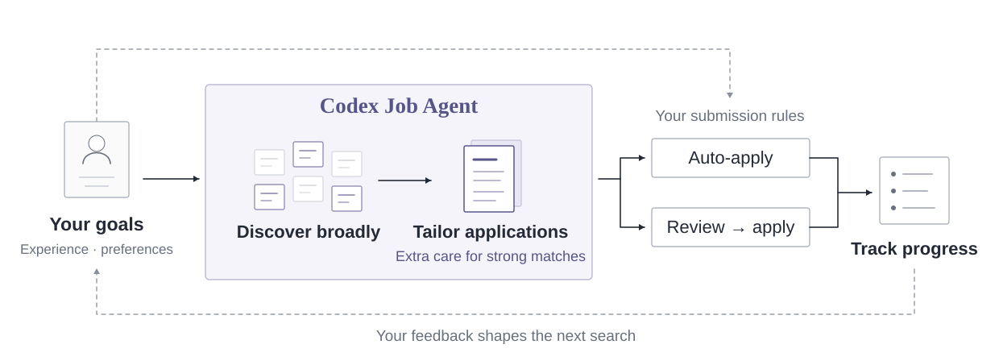

# Codex Job Agent

**English** · [简体中文](README.zh-CN.md)

**A runtime that lets an LLM agent take irreversible real-world actions safely, with job applications as the case study.**

**[Replay a recorded run](https://witazhang.github.io/codex-job-agent/demo/)** (no install): three applications go through the same executor, and in one of them the confirmation never appears. The page is generated from a real demo run; the source is [`docs/demo/index.html`](docs/demo/index.html).

## The problem

Agents are good at judgement and bad at guarantees. An application, an email or a payment cannot be taken back once sent, and the failures that matter are mechanical: acting without permission, acting on materials that changed after review, acting twice, or reporting a success nobody observed.

This project splits the work along that line.

| | Codex (skills) | Runtime (Python) |
| --- | --- | --- |
| Owns | Fit judgement, which confirmed facts to use, answers and wording | Authorization, versions, state, browser execution, receipts, retry rules |
| When it is wrong | Caught by sampled independent review | Not allowed to be: enforced in code and tested |

A model saying "submitted" never counts. Only the executor can submit, and only an observed receipt marks success.

## 1. Execution boundary

- **Approval binds the whole packet.** Answers, attachment hashes, job and profile versions and the browser plan form one hash. If any of them changes, the approval stops applying.
- **Policy decides the route, review is the default.** Automatic submission is limited to the fit tiers, domains and companies the user authorized, under a daily attempt budget.
- **Dry run first.** The browser fills the form with every write request and cross-origin load blocked until the submission step.
- **Job content is untrusted input.** It cannot authorize actions or change policy.

## 2. Failure recovery

- **Intent before action.** A submission intent is persisted before the click, under a per-job lease, so two executors cannot submit the same application.
- **Unknown stays unknown.** A missing receipt or an interrupted process becomes `unknown`, which blocks automatic retry. Only a reconciliation with user-checked evidence moves it to `submitted` or `retryable`.
- **Side processes cannot overwrite results.** A failure in quality sampling stays visible in the review queue and never changes a confirmed submission.

## 3. Evaluation

- **Sampled audits of what was actually sent.** Submitted materials are frozen. A configurable share (1 in 10 by default) goes to two fresh contexts: one judges hiring relevance, the other checks every claim against confirmed facts. Findings must cite source IDs and exact text.
- **The evaluator is tested too.** Six synthetic cases, each judged in both A/B orders (12 decisions), check for padding preference, order bias, same-length degradation and useful expansion. That run showed 0/4 padding preference and 0/6 order inconsistency. In a planted-defect test, the factual reviewer flagged an unsupported 80% revenue claim nobody told it to look for.
- **Design choices are measured.** Updating the user profile directly with Codex and with LangMem both scored 24/24 on synthetic multi-turn edits, so the simpler direct update stays. See the [experiment](docs/agent/PROFILE_MEMORY_EXPERIMENT.md).
- **245 tests**, including real Chromium against a loopback ATS, run on Windows and Ubuntu CI.

## What the replay shows

| Run | Route | Employer received | Agent observed | Final state |
| --- | --- | --- | --- | --- |
| Review required | Submit refused before approval; dry run made 0 POSTs; approval bound to the packet hash | 1 POST | Receipt | `submitted` |
| Inside automatic scope | Policy allowed automatic submission | 1 POST | Receipt | `submitted` |
| Receipt never shown | Policy allowed automatic submission | 1 POST | Nothing | `unknown`, retry refused |

In every run the resume hash the employer received matches the approved packet. The replay uses synthetic people and jobs, and no language model runs in it: it tests the runtime.

## Case study: a personal job-search agent

<picture>
  <source media="(max-width: 700px)" srcset="docs/assets/architecture.en.compact.svg">
  
</picture>

The runtime drives a job search inside Codex. The user confirms their experience, preferences and which applications may go out automatically. Codex then finds openings on Greenhouse, Lever and Ashby boards, judges fit with cited evidence, prepares materials only from confirmed facts, and submits within the saved policy. Questions and reviews are collected for the user in one place.

| Skill | Role |
| --- | --- |
| `$applypilot` | Coordinate the session, queue, applications and quality reviews |
| `$applypilot-onboard` | Confirm facts, preferences, constraints and submission authorization |
| `$applypilot-discover` | Find openings, research requirements and record supported fit judgments |
| `$applypilot-prepare` | Prepare packets, inspect forms, dry-run and execute authorized submissions |

Skills live in [`.agents/skills/`](.agents/skills/). The `applypilot*` skill names, `applypilot-agent` CLI and `applypilot_agent` module keep their names for compatibility. The [usage guide](docs/agent/USAGE.md) covers the daily workflow.

## Run it

You need [uv](https://docs.astral.sh/uv/). `uv.lock` pins every dependency.

```sh
git clone https://github.com/WItaZhang/codex-job-agent.git
cd codex-job-agent
uv sync --locked --extra dev
uv run playwright install chromium

# Three scenarios against an isolated local mock ATS, then build the replay page
uv run python -m applypilot_agent.demo --config configs/demo.yaml
uv run python docs/demo/build_replay.py logs/<run_id>

# Engineering checks
uv run ruff check src/applypilot_agent tests/agent
uv run ruff format --check src/applypilot_agent tests/agent
uv run python -m pytest tests/agent -q
uv run python -m applypilot_agent.evaluation --config configs/evaluation.yaml
```

If Playwright cannot download its browser, set `browser.executable_path` in the YAML config to an installed Chromium.

To use it for a real search, open the directory as a Codex project and start with:

> Use $applypilot-onboard to set up my job-search assistant. I'll provide my resume. Help me confirm my experience, job preferences and constraints, then agree with me on which applications can be automatic and which need review.

[`configs/agent.yaml`](configs/agent.yaml) holds budgets, policy and browser settings. Personal state stays in Git-ignored `data/local/`; run outputs go to `logs/`.

## Scope and limits

- **Browser support:** observable native forms. Logins, CAPTCHAs, iframes and complex widgets need an adapter or a human handoff; many large ATS platforms are not covered.
- **Materials:** source references and file hashes check provenance and integrity. They cannot prove every rewrite is factually correct.
- **Evidence:** model reviews are proxy judgements and synthetic labels are engineering fixtures. There are no measured interview, offer or cost results yet.
- **Isolation:** the tools enforce the supported execution path. They are not a security sandbox against an agent with full shell access.
- **Operation:** work runs while a Codex session is active; there is no background scheduler.

Details: [quality design](docs/agent/QUALITY.md) · [verification record](docs/agent/VERIFICATION.md).

## Explore the project

```text
src/applypilot_agent/   Runtime: contracts, policy, persistence, browser, execution, quality, evaluation
.agents/skills/         Codex skills and operating references
tests/agent/           Unit, integration and local browser tests
evals/                 Labelled synthetic evaluation fixtures
configs/               Runtime, demo and evaluation configuration
docs/                  Design, usage, verification and the demo replay
```

| Guide | What it covers |
| --- | --- |
| [Architecture · 中文](docs/agent/ARCHITECTURE.md) | Components, responsibilities and design tradeoffs |
| [Usage · 中文](docs/agent/USAGE.md) | Setup, commands and operating boundaries |
| [Implementation](docs/agent/IMPLEMENTATION.md) | Contracts and module responsibilities |
| [Quality · 中文](docs/agent/QUALITY.md) | Sampling, evaluator calibration and controlled iteration |
| [Evaluation data](evals/README.md) | Ground truth, provenance and dataset conventions |
| [Verification](docs/agent/VERIFICATION.md) | Recorded checks and their scope |

## License and acknowledgements

Developed and maintained by **WItaZhang**. Project provenance and acknowledgements are recorded in [NOTICE.md](NOTICE.md). Licensed under [AGPL-3.0-only](LICENSE).
