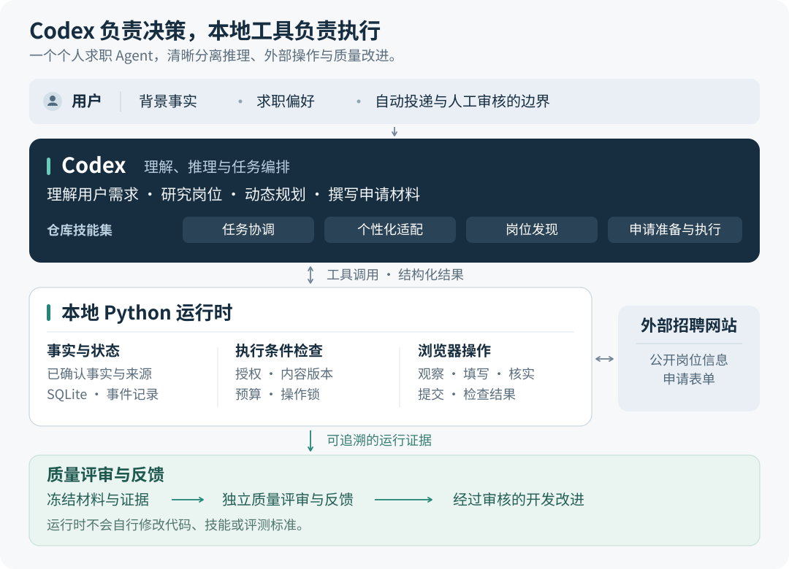

# Codex Job Agent

[English](README.md) · **简体中文**

面向 **Codex** 的个人求职 Agent：扩大机会覆盖，为高匹配岗位投入更多精力，由你决定哪些申请可以自动投递。

## 如何工作

<picture>
  <source media="(max-width: 700px)" srcset="docs/assets/architecture.zh-CN.compact.svg">
  
</picture>

*图 1. 求职目标指导搜索，投递规则由你设定，高匹配岗位获得更多准备投入。*

**先了解你。** 确认你的经历、求职偏好和限制，再设定自动投递与人工审核的边界。这些信息会在后续会话中持续复用。

**广泛找机会，重点做准备。** Codex 研究岗位，依据你已确认的经历准备申请，为高匹配岗位投入更多精力。它可以继续未完成的工作，并随新信息调整优先级。

**投递由你掌控。** 申请遵循你保存的规则；需要你补充的信息、审核的材料和投递进展集中呈现。你的反馈会帮助调整后续选择。

日常操作见[使用指南](docs/agent/USAGE.md)，实现细节见[工程设计](docs/agent/ARCHITECTURE.md)。

## 快速开始

需要 [uv](https://docs.astral.sh/uv/) 和可访问本地项目的 Codex。Python 版本由 `.python-version` 指定，依赖版本由 `uv.lock` 锁定。

```sh
git clone https://github.com/WItaZhang/codex-job-agent.git
cd codex-job-agent
uv sync --locked --extra dev
uv run playwright install chromium
uv run applypilot-agent --help
```

把这个目录作为 **Codex 项目打开**，首次使用可以说：

> 用 $applypilot-onboard 配置我的求职助手。我会提供简历，请先整理经历、求职方向和限制，再与我确认哪些岗位可以自动投递、哪些需要先审核材料。

后续会话可以说：

> 用 $applypilot 继续今天的求职，最多处理 80 个岗位。优先准备高匹配机会，按保存的授权执行申请，需要我回答的问题集中给我。

岗位数量是研究、筛选和准备的会话预算，不代表实测吞吐量或同等数量的投递承诺。工作在当前 Codex 会话中进行，项目没有内置常驻后台调度器。

### 四个技能，一个助手

| 技能 | 职责 |
| --- | --- |
| `$applypilot` | 协调会话、队列、申请和质量复核 |
| `$applypilot-onboard` | 确认事实、求职偏好、限制和投递授权 |
| `$applypilot-discover` | 发现岗位、研究要求并记录有依据的匹配判断 |
| `$applypilot-prepare` | 准备申请包、观察表单、试填并执行获准的提交 |

技能位于 [`.agents/skills/`](.agents/skills/)。如果当前会话尚未发现技能，可在项目内开启新会话，或让 Codex 读取对应的 `SKILL.md`。

项目名称为 `codex-job-agent`；为兼容已有操作方式，保留 `applypilot*` 技能名、`applypilot-agent` CLI 和 `applypilot_agent` Python 模块名。

## 你的配置与数据

[`configs/agent.yaml`](configs/agent.yaml) 管理工作规模、每日提交尝试限额、审核策略、浏览器设置和质量抽检。**默认需要审核。** 首次适配时根据你的授权确定自动投递边界。配置中的路径相对于 YAML 文件解析。

```sh
uv run applypilot-agent --config configs/agent.yaml status
uv run applypilot-agent --config configs/agent.yaml inbox
uv run applypilot-agent --config configs/agent.yaml dashboard
```

个人状态和申请材料保存在被 Git 忽略的 `data/local/`，实验与演示产物写入 `logs/`。`dashboard` 生成本地工作台页面。简历、联系方式和浏览器登录状态应留在本地，不要提交到 Git。用于推理的内容会进入当前 Codex 会话，本地存储不代表离线推理。

## 质量与当前能力

执行器在提交前冻结获授权的材料，本地工具对已确认投递进行抽样。协调技能再组织独立的 Codex 上下文，分别评审岗位相关性与事实依据。发现的问题保留证据并进入待办；评审器偏差检查和版本比较用于支持开发迭代。

模型评审是**代理判断**，合成标签是**工程用例**，两者都不能证明真实面试率或录用率。证据与覆盖范围见[质量设计](docs/agent/QUALITY.md)和[验证记录](docs/agent/VERIFICATION.md)。

- **浏览器支持：** 面向可观察的原生表单。复杂控件、iframe、登录、验证码或填写期间的后台上传可能需要适配或人工接手，尚未覆盖所有 ATS。
- **申请材料：** 内置渲染器排版已确认事实。来源引用和文件哈希用于检查出处与完整性，无法单独证明任意改写都符合事实。
- **执行边界：** 工具检查受支持的执行路径；它们不是针对拥有完整 shell 权限的 Agent 的安全沙箱。
- **验证范围：** 首版已通过 208 项本地测试及 [Windows、Ubuntu CI](https://github.com/WItaZhang/codex-job-agent/actions/runs/37535531580)，尚未建立真实招聘效果或成本改善的结论。

<details>
<summary><strong>运行工程检查</strong></summary>

```sh
uv run ruff check src/applypilot_agent tests/agent
uv run ruff format --check src/applypilot_agent tests/agent
uv run python -m pytest tests/agent -q

# 在隔离的本地模拟 ATS 上演示浏览器执行
uv run python -m applypilot_agent.demo --config configs/demo.yaml

# 使用合成工程用例比较基线与候选版本
uv run python -m applypilot_agent.evaluation --config configs/evaluation.yaml
```

测试覆盖授权与材料版本、并发执行、提交意图、中断恢复、未知结果处理、质量抽检和评测输入。演示只向本地模拟 ATS 提交。

</details>

## 项目导航

```text
.agents/skills/         Codex 技能及操作参考
configs/               运行、演示和评测配置
src/applypilot_agent/   模块化运行时、质量与评测工具
tests/agent/           单元、集成与本地浏览器测试
evals/                 明确标注来源的评测用例
docs/agent/            设计、使用与验证文档
```

以下详细文档分别以中文或英文维护，语言见链接标注。

| 文档 | 内容 |
| --- | --- |
| [架构设计](docs/agent/ARCHITECTURE.md) | 系统组成、职责划分与设计取舍 |
| [使用指南](docs/agent/USAGE.md) | 安装、命令与操作边界 |
| [实现契约 · English](docs/agent/IMPLEMENTATION.md) | 数据契约与模块职责 |
| [质量评测](docs/agent/QUALITY.md) | 抽样复核、评审器校准与受控迭代 |
| [评测数据 · English](evals/README.md) | Ground truth、来源与数据集约定 |
| [验证记录 · English](docs/agent/VERIFICATION.md) | 已完成的检查及适用范围 |

## 许可与致谢

由 **WItaZhang** 开发和维护。本独立仓库包含面向 Codex 设计的实现，项目来源与致谢见 [NOTICE.md](NOTICE.md)，采用 [AGPL-3.0-only](LICENSE) 许可证。
