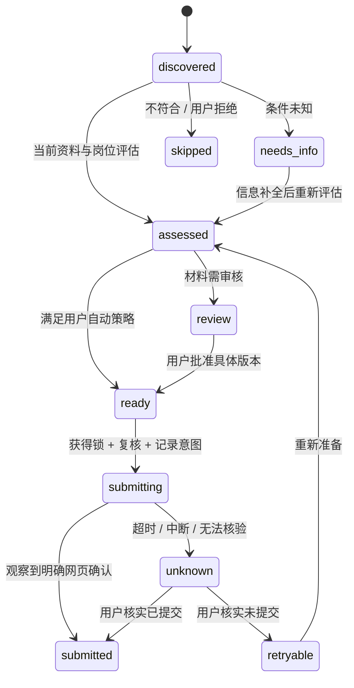

# Codex 求职 Agent：设计与工程边界

## 目标与取舍

这是 git clone 后在本地 Codex 项目中运行的个人 agent。每天的目标是处理
50–100 个候选岗位，扩大用户愿意申请的范围，同时把更多准备时间留给高匹配岗位。
处理数量包含筛选、研究和准备，不能等同于投递数量。

用户先确认事实、求职方向、硬性限制，以及自动投递和审核的边界。Codex 可以
调整研究和准备的次序、复用材料、补充岗位、在新证据出现时重新判断。执行器
只强制事实引用、版本、授权、预算和外部操作状态的契约。

选择技能集，是因为用户已经在使用 Codex。这里不再嵌入第二套 LLM 调用循环，
不增加模型 API key，也不让本地工具的 prompt 与 Codex 争夺规划权。Python
提供窄而明确的操作，而不是把浏览器动作和字符串成功标记拼成固定流水线。

## 组件

<picture>
  <source media="(max-width: 700px)" srcset="../assets/architecture.zh-CN.compact.svg">
  
</picture>

图 (a) 区分已确认事实、偏好与投递授权；图 (b) 展示 Codex 与本地工具的动作—
观察循环，并把读取岗位与获准后的提交分开；图 (c) 区分运行期的抽样评审与
开发期的根因分析、回归和实现修改。图形由 [同一份源文件](../assets/build_architecture.py)
生成中英文宽版与窄版，保持职责和标注一致。

`models.py` 只定义结构；`matching.py` 和 `policy.py` 不执行 I/O。
`store.py` 只处理持久化。`service.py` 对完整操作使用短事务。
`execution.py` 跨越外部副作用边界；`browser.py` 不读取用户授权、不写数据库。
`cli.py` 负责输入输出。评测的 schema 独立于运行时，避免修改业务模型时偷偷改变验收标准。

## 数据与个性化

事实有来源、确认状态、可选的表单值和岗位适用范围。事实与偏好分开，用户拒绝
某个岗位的反馈会持续约束后续判断。未经用户确认的内容不能成为申请材料的引用。

岗位保留完整描述和版本。来源身份与实际投递地址共同用于去重：同一投递目标
从不同来源出现时保留一个申请，保存来源观察，并刷新变化的岗位内容。只去除
明确的追踪参数；岗位 ID 等功能参数保留。不能以公司名和职位名相同就合并两个岗位。

本地基线用于解释性筛选；阈值和词项参数在 YAML 中配置。它不会获得自动提交
权限。Codex 的评估必须绑定当前岗位、当前资料、确认的经历证据，并服从显式硬约束。
缺失条件进入 unknown，不能借低分把系统故障或缺少信息隐藏掉。

第一版没有训练个人大模型。用户反馈直接改变确认的偏好和选择；只有在积累了
足够的人类标签并完成独立比较后，才有理由引入学习排序。当前没有宣称这种训练已完成。

## 授权与事务

审批绑定完整 packet：岗位与资料版本、答案、事实引用、附件内容 SHA256 和浏览器
计划。任何材料变化都要重新检查。自动提交也会在浏览器准备后重新读取状态和预算。
词法基线、无匹配证据、未知条件或外部未审核附件不能悄悄进入自动提交。

每个申请持有操作系统文件锁，进程退出后由 OS 释放；SQLite 事务负责预约提交。
浏览器点击前先落盘 `submit_intent`，之后才观察确认。数据库与第三方网站没有
分布式事务，所以不声称 exactly-once。这里保证未知结果不会自动重试。

恢复操作先尝试获取同一个 OS 锁，跳过仍活跃的执行器；未知结果的人工核验也
使用这把锁，不能借核验把正在运行的操作解锁。无法确认时保留 unknown。

这些契约是正常工具路径的工程约束。拥有任意 shell 权限的 agent 可以修改程序
或数据库，技能和 SQLite 不是针对这种权限的安全沙箱。部署时需要继承 Codex 的
权限边界，不能把提示词称为不可绕过的安全机制。

## 评测与迭代

分开评测：操作正确性、目标覆盖、重点岗位质量。不能用总体平均分抵消越权提交、
编造事实或错误宣告成功。任务全集固定，漏掉的预测仍进入分母；未知人工标签单独报告。

开发过程是：可复现问题 → 判断受影响模块 → 解释修改假设 → 最小修改 → 行为回归
→ 独立检查。没有“遇到一次错误就追加一条 skill 禁令”的自动修补器。运行中的
求职 agent 不会编辑源码、技能、GT 或评审标准。用户也不必审核技术补丁。

`export-observations` 从运行事件导出评测输入，并保留关联证据。它不能使可写的
本地数据库成为防篡改证据；实际演示另用测试 ATS 的接收账本核对字段与附件。
公开合成 dev/holdout 只是工程用例，不能冒充保密验收集或真实求职效果。

真实标签需要征得同意的用户选择与偏好、材料盲评和真实招聘反馈。材料质量允许
平局与分歧；模型评审作为代理指标，与人类标签分开。当前没有真实用户 GT，也
没有面试率提升的结论。详见 `evals/README.md`。

新增的 `quality` 模块在提交前冻结授权材料，在确认后形成持久化随机批次。
协调技能给无历史上下文的两个评审会话分发招聘视角与事实视角材料，并收回
有引用的模型代理报告。抽样和证据验证由 Python 执行；模型不能重抽样或改变
生产规则。告警进入本地待办，已读与解决分开。

发布前的 `evaluation.calibration` 用匿名对照、顺序交换与正对照检查评审偏差。
`improvement` 将告警、根因假设、具名回归、两版指标和独立验收串起来，接受
记录不自动发布。实现边界与详细流程见 [QUALITY.md](QUALITY.md)。

## 当前兼容性与成本

公开岗位发现支持 Greenhouse、Lever 全球实例和 Ashby；手动研究也能导入。
浏览器已验证的是具有可识别原生控件与明确回执的单页表单。实际站点中的验证码、
登录、iframe、跨来源依赖、自动上传解析和自定义控件会影响可执行范围。
发现某个 ATS 的岗位不等于已验证该 ATS 的自动投递兼容性。

常态运行复用 Codex 会话与本地 SQLite，无常驻服务。计划预留高匹配岗位名额，
剩余按等待时间处理；提交尝试按 UTC 日单独限额。浏览器默认逐个执行。
定时运行依赖用户明确配置的 Codex 自动化，不会在安装时隐式注册后台任务。

已验证的能力和未验证的范围记录在 `VERIFICATION.md`；使用方式见 `USAGE.md`。
